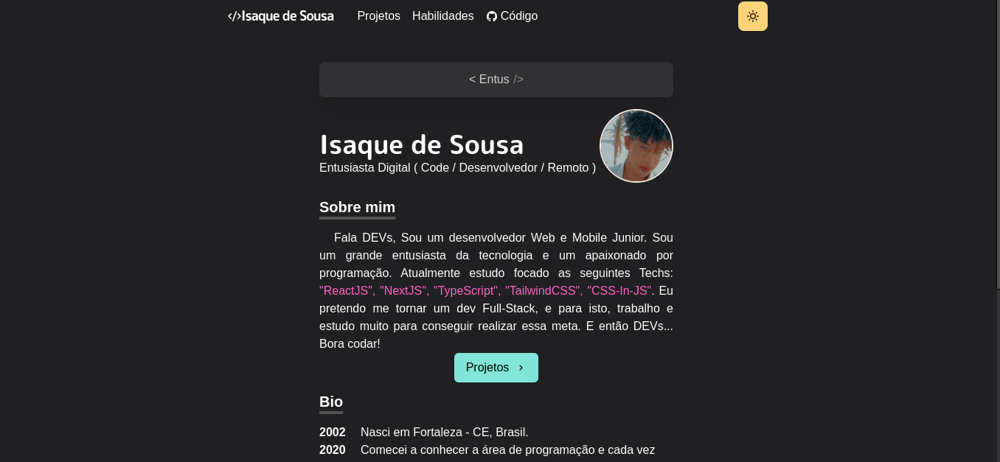
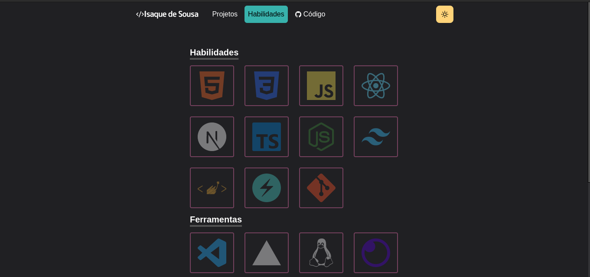

# Portfolio

Creation of my portfolio personal 🚀


---

# 🛠 Technologies used

- Next.js
- Typescript
- HeadlessUi
- Framer-motion
- TailwindCSS

# 🤔 How to run

Clone repository:

```sh
git clone git@github.com:X-SpeedBlack-X/Portfolio.git
```

At the root of the project, **Install dependencies** with the comamand:

```bash
yarn
```

Or

```sh
npm install
```

# 🎨 Layout




# License 📚

[MIT license](LICENSE).

Made by [Isaque de Sousa](https://github.com/X-SpeedBlack-X)

Give a ⭐️!
